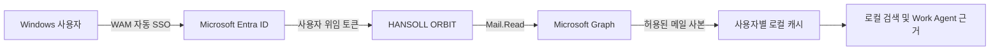

# HANSOLL ORBIT 보안 및 데이터 흐름

## Microsoft 인증

- 기본 인증: Microsoft Authentication Library + Windows Web Account Manager(WAM)
- 대체 인증: Microsoft Authentication Library for Node (`@azure/msal-node`)
- 앱 유형: Public Client desktop application
- 인증 화면: 시작 시 화면 없는 Windows 계정 SSO, 필요한 경우에만 Windows 계정 승인 창
- 권한 방식: 사용자가 로그인한 상태의 delegated permission
- 기본 권한: `Mail.Read`
- 선택 권한: `Mail.Read.Shared`
- 사용하지 않는 항목: Client secret, application-wide mailbox permission, `Mail.Send`,
  `Mail.ReadWrite`

## 데이터 흐름

## 로컬 저장

- Electron의 사용자별 `userData` 폴더에 저장합니다.
- WAM/MSAL 토큰 캐시는 Electron `safeStorage`를 통해 Windows DPAPI로 암호화합니다.
- 선택 계정과 메일 캐시는 Microsoft tenant/account 식별자로 분리합니다.
- 원본 메일은 Microsoft 365에 유지되며 앱은 원본을 삭제하거나 수정하지 않습니다.
- 업무 건, 할 일, 일정, 결정 기록은 해당 Windows 사용자 로컬 앱 데이터에 저장합니다.

## 검토 빌드의 데이터

- 패키지 내부 데이터는 `DEMO-STYLE-*`, `example.invalid` 등 합성 값만 사용합니다.
- 소스 코드 묶음에서 `.env`, SQLite DB, 실제 메일, OneDrive 파일, 생성 Excel을 제외합니다.
- Microsoft 로그인을 수행하지 않으면 실제 회사 데이터가 생성되거나 저장되지 않습니다.
- Microsoft 로그인 후 Graph 동기화를 시험하면 실제 메일 사본이 사용자별 앱 데이터에 저장될
  수 있으므로 승인된 테스트 계정을 사용하십시오.

## 네트워크 대상

- `login.microsoftonline.com`: Microsoft 로그인 및 토큰 발급
- `graph.microsoft.com`: 허용된 Microsoft Graph 메일 조회
- AI 공급자 엔드포인트: 아래 "AI 공급자 데이터 전송" 항목 참조. 사용자가 공급자를 연결하고
  외부 데이터 사용을 승인한 경우에만 통신하며 운영 정책으로 비활성화할 수 있습니다.

## AI 공급자 데이터 전송

Work Agent의 답변 생성은 로컬 규칙 기반 모드와 외부 AI 공급자 모드 두 가지입니다.
외부 모드는 사용자가 공급자를 연결하고 외부 데이터 사용을 명시적으로 승인한 뒤에만 켜집니다.
승인 상태는 사용자별 로컬 설정에 저장되며, 승인 전에는 로컬 규칙 기반 모드로만 동작합니다.

- 실행 방식: 로컬에 설치된 공급자 CLI를 자식 프로세스로 실행합니다. ORBIT은 자체 API 키를
  보관하지 않으며 인증은 해당 CLI가 관리합니다.
- 지원 공급자와 통신 대상
  - OpenAI Codex CLI: `chatgpt.com`, `api.openai.com`
  - Anthropic Claude Code: `api.anthropic.com`
- 전송 항목
  - 사용자 질의 원문
  - 메일 근거: 수신 일시, 발신자 표시명(최대 120자), 제목(최대 300자), 본문 발췌(최대 1,000자)
  - 파일 근거: 상대 경로(최대 500자), 시트·위치(최대 160자), 발췌(최대 700자), Style 번호,
    색인 시각
  - 워크플로 상태: 단계 신호, 수량 통제 값, 블로킹 리스크, 다음 조치 후보
- 전송 전 처리
  - 이메일 주소는 `[email omitted]`로 치환합니다.
  - 절대 경로 대신 소스 루트 기준 상대 경로만 전송합니다.
  - 모든 필드를 위 길이 제한으로 잘라냅니다.
- 전송하지 않는 항목: 원본 파일 첨부, Microsoft 액세스 토큰, 자격 증명, 생성된 Excel 파일
- 비활성화: 공급자를 연결하지 않거나 외부 데이터 승인을 해제하면 전송이 발생하지 않습니다.

## 현재 제한

- 검토 빌드는 코드 서명되지 않았습니다.
- 검토 모드에서는 실제 업무 파일 검색과 Excel 산출물 생성을 수행하지 않습니다.
- 검토 모드는 패키지에 포함된 표식 파일로만 켜지며, 설치된 빌드에서는 환경 변수로 전환할 수
  없습니다. 합성 데이터가 표시될 때는 창 제목과 화면 배지에 "IT 검토용"이 항상 나타납니다.
- 운영용 중앙 감사 로그, 원격 삭제, MDM 정책은 아직 연결하지 않았습니다.
- Graph 연결 가능 여부는 Exchange Online과 회사 Entra 정책에 따라 달라집니다.
