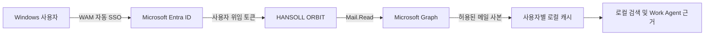

# HANSOLL ORBIT 보안 및 데이터 흐름

## Microsoft 인증

- 기본 인증: Microsoft Authentication Library + Windows Web Account Manager(WAM)
- 대체 인증: Microsoft Authentication Library for Node (`@azure/msal-node`)
- 앱 유형: Public Client desktop application
- 인증 화면: 시작 시 화면 없는 Windows 계정 SSO, 필요한 경우에만 Windows 계정 승인 창
- 권한 방식: 사용자가 로그인한 상태의 delegated permission
- 기본 권한: `Mail.Read`
- 선택 권한: `Mail.Read.Shared`
- 사용하지 않는 항목: Client secret, application-wide mailbox permission, `Mail.Send`,
  `Mail.ReadWrite`

## 데이터 흐름

## 로컬 저장

- Electron의 사용자별 `userData` 폴더에 저장합니다.
- WAM/MSAL 토큰 캐시는 Electron `safeStorage`를 통해 Windows DPAPI로 암호화합니다.
- 선택 계정과 메일 캐시는 Microsoft tenant/account 식별자로 분리합니다.
- 원본 메일은 Microsoft 365에 유지되며 앱은 원본을 삭제하거나 수정하지 않습니다.
- 업무 건, 할 일, 일정, 결정 기록은 해당 Windows 사용자 로컬 앱 데이터에 저장합니다.

## 검토 빌드의 데이터

- 패키지 내부 데이터는 `DEMO-STYLE-*`, `example.invalid` 등 합성 값만 사용합니다.
- 소스 코드 묶음에서 `.env`, SQLite DB, 실제 메일, OneDrive 파일, 생성 Excel을 제외합니다.
- Microsoft 로그인을 수행하지 않으면 실제 회사 데이터가 생성되거나 저장되지 않습니다.
- Microsoft 로그인 후 Graph 동기화를 시험하면 실제 메일 사본이 사용자별 앱 데이터에 저장될
  수 있으므로 승인된 테스트 계정을 사용하십시오.

## 네트워크 대상

- `login.microsoftonline.com`: Microsoft 로그인 및 토큰 발급
- `graph.microsoft.com`: 허용된 Microsoft Graph 메일 조회
- 사용자가 선택한 AI 공급자 연결 기능은 Outlook 연결과 별도이며 운영 정책에 따라 비활성화할
  수 있습니다.

## 현재 제한

- 검토 빌드는 코드 서명되지 않았습니다.
- 검토 모드에서는 실제 업무 파일 검색과 Excel 산출물 생성을 수행하지 않습니다.
- 운영용 중앙 감사 로그, 원격 삭제, MDM 정책은 아직 연결하지 않았습니다.
- Graph 연결 가능 여부는 Exchange Online과 회사 Entra 정책에 따라 달라집니다.
